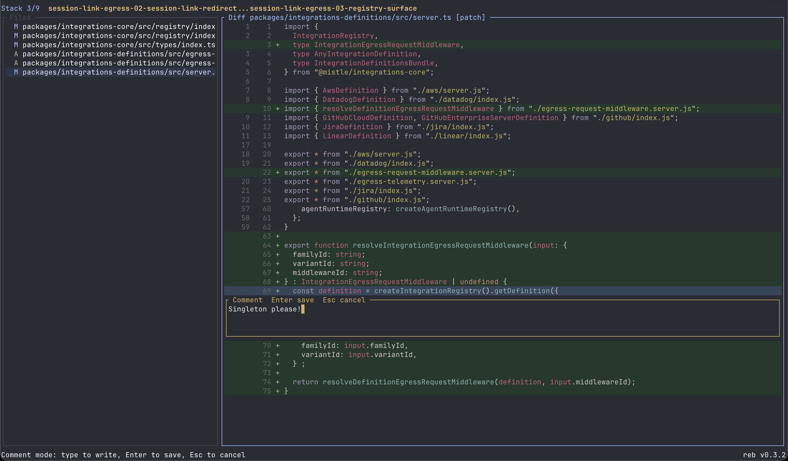

# rebyua

`rebyua` is a lightweight local diff review tool for coding-agent loops.

The executable is `reb`: a fast terminal UI for reviewing changed files, adding line, range, and file-level comments, and copying a Markdown review back into your agent workflow.

## Screenshot

<p align="center">
  
</p>

## Overview

Use `reb` when you want a clean local review pass between agent iterations:

- inspect changed files and diffs in a minimal TUI
- switch between patch view and whole-file context
- leave comments on a line, a selected range, or an entire file
- copy the review to your clipboard and paste it straight into your coding agent

The initial release targets macOS and Linux.

## Installation

### Install Script

Install the latest GitHub release with:

```bash
curl -fsSL https://raw.githubusercontent.com/thomasjiangcy/rebyua/main/scripts/install.sh | sh
```

### GitHub Releases

Download the latest archive from this repository's GitHub Releases page, unpack it, and place `reb` somewhere on your `PATH`.

### From Source

```bash
cargo install --path . --bin reb
```

## Usage

Run `reb` from inside a Git repository:

```bash
reb
```

`reb` and `reb review` are equivalent. Running `reb` without a subcommand starts review mode directly.

You can also review against a different base, restrict paths, or inspect staged changes:

```bash
reb review
reb review --base origin/main
reb review --staged
reb review --path src/app.rs --path src/cli.rs
```

### Day-to-Day Workflow

1. Ask your coding agent to make a change.
2. Run `reb`.
3. Move through files and diffs, add comments, then press `E` to copy the review as Markdown.
4. Paste that review back into your coding agent.
5. Repeat until the patch is where you want it.

To update an existing install from GitHub Releases:

```bash
reb update
```

This checks the latest GitHub release for the current platform and replaces the installed `reb` binary in place.

### Core Keys

- `h` / `l`: move focus between the file list and diff pane
- `j` / `k`: move within the focused pane
- `[` / `]`: jump to previous or next file
- `gg` / `G`: jump to top or bottom
- `J` / `K`: jump between hunks
- `t`: toggle between patch view and whole-file context
- `v`: start or lock a line-range selection
- `c`: comment on the current line or selected range
- `C`: comment on the current file
- `Enter`: open or close comments on the current line
- `F`: select file-level comments for the current file
- `e`: edit the selected comment
- `d`: delete the selected comment, with confirmation
- `/`: search in the diff pane, or filter files when the file list is focused
- `n` / `p`: jump to next or previous search match
- `:<line>`: jump to a visible line number in the current diff or file view
- `E`: copy the current review to the clipboard as Markdown
- `q`: quit

## Clipboard Support

`reb` copies reviews directly to the system clipboard:

- macOS: `pbcopy`
- Linux: `wl-copy` or `xclip`

## License

MIT. See [LICENSE](LICENSE).
